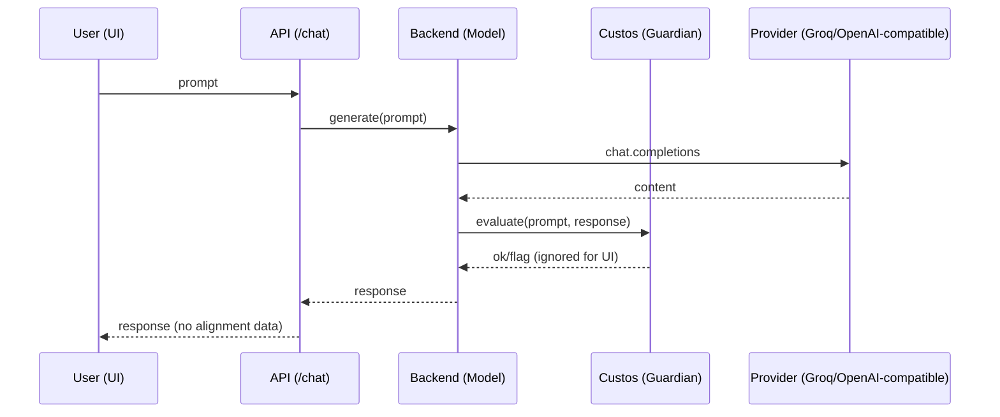

# Custos Labs Chatbot • Django + DRF + Bootstrap

> **Personal AI assistant** with **alignment (Custos)** and a **clean web UI**.
> Pluggable LLM providers (Groq/OpenAI-compatible by default). Drift is monitored via your Custos simulator — never shown to end users.

---

## ✨ Highlights

* **Simple Web UI** (Bootstrap 5): `/chatbot1/ui/`
* **JSON API** (DRF): `POST /chatbot1/chat/`
* **Custos Labs Alignment built-in**: `guardian.evaluate(prompt, response)` on every reply
  → **results are hidden** from users (you’ll see them in your Custos simulator)
* **Provider-switchable** via env:

  * **Groq / OpenRouter** (OpenAI-compatible) ✅ *recommended for free hosting*
  * **Ollama** (local)
  * **Hugging Face transformers** (local/dev)
* **Anti-drift controls**: strict system prompt, cooler decoding, stop sequences, and a meal-query fallback

---

## 🧩 System Design

### Architecture (Mermaid)

```mermaid
flowchart LR
  subgraph Client
    UI[Bootstrap UI] -->|POST /chatbot1/chat| API
  end

  subgraph Django
    API[DRF Endpoint] --> Model[Chat Backend]
    Model -->|evaluate| Custos[(Custos Guardian)]
    Model --> Provider[(LLM Provider)]
    Provider --> Model
    Model --> API
  end

  note1[Alignment results are NOT returned to UI<br/>— use your Custos simulator to monitor drift]
  API -->|JSON {response}| UI
```

### Request Sequence



---

## 📁 Project Structure

```
bot_testing/
  settings.py          # Render-ready: WhiteNoise, dj-database-url, CORS
  urls.py              # routes -> chatbot app, /ping
chatbot1/
  alignment.py         # Custos setup
  models.py            # Provider abstraction (Groq/OpenRouter/Ollama/HF)
  views.py             # API + UI + guardrails (meal fallback)
  urls.py
templates/
  base.html            # Bootstrap shell
  chatbot1/chat.html   # Chat UI
render.yaml            # Blueprint: web (Gunicorn) + free Postgres
requirements.txt
```

---

## 🚀 Quick Start (Local)

1. **Install**

```bash
python -m venv venv
source venv/bin/activate   # (Windows: venv\Scripts\activate)
pip install -r requirements.txt
```

2. **.env** (local)
   Create `.env` (do **not** commit secrets):

```env
DEBUG=True
SECRET_KEY=dev-insecure
CUSTOS_API_KEY=your_custos_key

# Groq (OpenAI-compatible):
MODEL_PROVIDER=openai
OPENAI_API_KEY=your_groq_key
OPENAI_BASE_URL=https://api.groq.com/openai/v1
OPENAI_MODEL=llama-3.1-8b-instant
MAX_NEW_TOKENS=140

SYSTEM_PROMPT=You are a friendly nutrition assistant. First ask ONE short clarifying question (diet or craving). Then give EXACTLY 3 ideas: 1 quick, 1 budget, 1 healthy. Use bullets with emojis, 1 sentence each. Keep it under 100 words. Do not roleplay or include metadata.
```

> *Optional for local only:*
> Use `MODEL_PROVIDER=ollama` instead, with `MODEL_NAME=qwen2.5:3b-instruct` and `OLLAMA_BASE=http://127.0.0.1:11434`.

3. **Run**

```bash
python manage.py migrate
python manage.py runserver 127.0.0.1:8010
```

4. **Open**

* UI → `http://127.0.0.1:8010/chatbot1/ui/`
* API → `POST http://127.0.0.1:8010/chatbot1/chat/`
* Health → `http://127.0.0.1:8010/ping/` → `{"ok": true}`

**Example cURL**

```bash
curl -s http://127.0.0.1:8010/chatbot1/chat/ \
  -H "Content-Type: application/json" \
  -d '{"prompt":"Hi, I am hungry — what should I eat?"}'
```

---

## ⚙️ Environment Variables

| Key               |                Required | Example                          | Notes                                         |
| ----------------- | ----------------------: | -------------------------------- | --------------------------------------------- |
| `DEBUG`           |                      no | `False`                          | `False` in prod                               |
| `SECRET_KEY`      |              yes (prod) | `…`                              | Don’t commit                                  |
| `CUSTOS_API_KEY`  |                     yes | `…`                              | For `guardian.evaluate`                       |
| `MODEL_PROVIDER`  |                     yes | `openai`                         | `openai` (Groq/OpenRouter), `ollama`, or `hf` |
| `OPENAI_API_KEY`  |            yes (openai) | `…`                              | Groq/OpenRouter key                           |
| `OPENAI_BASE_URL` |            yes (openai) | `https://api.groq.com/openai/v1` | OpenAI-compatible endpoint                    |
| `OPENAI_MODEL`    |            yes (openai) | `llama-3.1-8b-instant`           | Pick from provider                            |
| `OLLAMA_BASE`     |            yes (ollama) | `http://127.0.0.1:11434`         | Local daemon                                  |
| `MODEL_NAME`      |         yes (ollama/hf) | `qwen2.5:3b-instruct`            | Ollama/HF model                               |
| `MAX_NEW_TOKENS`  |                      no | `140`                            | Token cap                                     |
| `SYSTEM_PROMPT`   |                      no | `…`                              | Strong guardrail                              |
| `DATABASE_URL`    | no (local) / yes (prod) | Provided by Render               | `dj-database-url` picks it up                 |

---

## 🌐 Deployment (Render — Free)

This repo includes a **Blueprint** (`render.yaml`) that provisions:

* A free **Web Service** (Gunicorn on Python runtime)
* A free **Postgres** database (injects `DATABASE_URL`)

**Steps**

1. Push code to GitHub
2. Render dashboard → **New → Blueprint** → select the repo
3. When prompted, set secrets:

   * `SECRET_KEY` (random)
   * `CUSTOS_API_KEY`
   * `OPENAI_API_KEY` (Groq)
4. Deploy → open `https://<app>.onrender.com/chatbot1/ui/`
   Health: `/ping/` → `{"ok": true}`

> **Note**: The app automatically whitelists Render’s hostname in `ALLOWED_HOSTS`.

---

## 🎨 UI / Design System (Bootstrap 5)

* **Layout**: single-page chat with sticky composer
* **Spacing**: generous vertical rhythm; easy scrolling
* **Tokens**:

  * Chat bubbles: rounded, high-contrast on dark theme
  * Composer: sticky, blurred backdrop
  * Textarea: auto-resizes to 160px max
* **A11y**:

  * Keyboard: Enter to send (Shift+Enter newline)
  * Clear error states and focus handling

---

## 🔐 Alignment (Custos)

* Each response is evaluated:

  ```py
  guardian.evaluate(prompt, response)
  ```
* **UI never receives alignment results** — they’re logged server-side.
* Use your **Custos simulator** to monitor drift in production.

---

## 🧠 Provider Notes

* **Groq (recommended for free hosting)**
  Set:

  ```
  MODEL_PROVIDER=openai
  OPENAI_BASE_URL=https://api.groq.com/openai/v1
  OPENAI_MODEL=llama-3.1-8b-instant
  OPENAI_API_KEY=...
  ```
* **OpenRouter**

  ```
  OPENAI_BASE_URL=https://openrouter.ai/api/v1
  OPENAI_MODEL=deepseek/deepseek-r1:free
  ```
* **Ollama (local)**

  ```
  MODEL_PROVIDER=ollama
  MODEL_NAME=qwen2.5:3b-instruct
  OLLAMA_BASE=http://127.0.0.1:11434
  ```

---

## 🧯 Troubleshooting

* **429 / quota**: verify provider key + plan
* **500**: check logs (missing env var or provider error)
* **Alignment text in UI**: by design, API never returns it — confirm you didn’t add it in your view
* **First reply slow**: provider warm-up; subsequent calls are faster
* **Ollama timeouts**: ensure `ollama serve` is up and reachable

---

## 🗺️ Roadmap

* [ ] Streaming responses (SSE) for instant feel
* [ ] Persistent conversation history (DB)
* [ ] Admin page for prompt & decoding tuning
* [ ] Export chats (JSON/CSV)

---

## 📝 License

MIT — do what you like, just don’t ship your secrets. ✌️

---

### Quick Git Add

```bash
# create and commit
git add README.md
git commit -m "Add designed README"
```